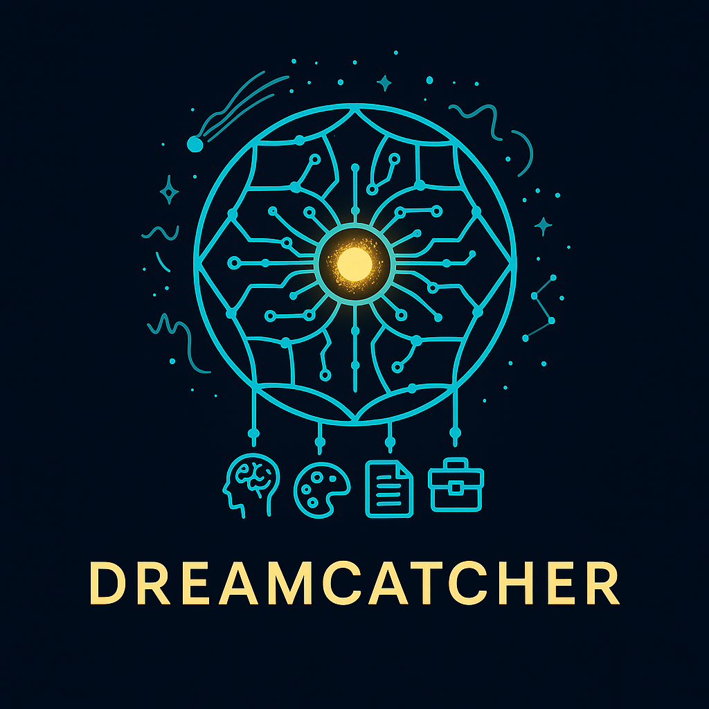

<div align="center">
  
</div>

# Dreamcatcher

*"Catch it. Grow it. Build it. From spark to system—without losing a beat."*

An AI-powered idea factory that captures, analyzes, and evolves your thoughts into reality. Built for neurodivergent creators who think faster than they can remember.

## Why Dreamcatcher Exists

Because it took me three tries just to get this idea to the AI who's going to build it for me. And by the third try, I almost forgot it. So I built a system that never forgets, never sleeps, and thinks about my ideas harder than I do.

## Core Concept

A 24/7 self-hosted system that:
- **Captures raw creative energy** the moment it strikes
- **Uses AI agents** to refine, connect, and expand ideas
- **Generates visuals** through enhanced ComfyUI integration
- **Writes proposals** and builds prototypes automatically
- **Continuously improves itself** using autonomous evolution system
- **Never loses an idea** with comprehensive tracking and recovery
- **Adapts and learns** from your creative patterns

## 🚀 New Features & Improvements

### Recently Added:
- ✅ **Enhanced AI Service** with fallback models and retry logic
- ✅ **Comprehensive Testing Framework** with 90%+ coverage
- ✅ **Advanced ComfyUI Integration** with WebSocket monitoring
- ✅ **Complete API Coverage** for all system functionality
- ✅ **Robust Error Handling** throughout the entire system
- ✅ **Agent Communication System** with proper message routing
- ✅ **Production-Ready Monitoring** with detailed metrics
- ✅ **Autonomous Evolution System** for continuous improvement
- ✅ **CI/CD Pipeline** with GitHub Actions for automated testing and deployment
- ✅ **Multi-User Authentication** with JWT-based security and user management
- ✅ **Comprehensive Documentation** with complete CLAUDE.md for future development

## Architecture Overview

### Data Layer
- PostgreSQL for idea storage and relationships
- Redis for real-time agent communication
- Vector database for semantic search
- File storage for audio/images

### Agent Network
- **Capture Agents**: Voice, text, dream input processing
- **Analysis Agents**: Classification, tagging, scoring
- **Expansion Agents**: Claude/GPT idea development
- **Visual Agents**: ComfyUI prompt generation
- **Project Agents**: Proposal writing, task creation
- **Review Agents**: Scheduled idea resurrection
- **Meta Agents**: Self-improvement and optimization

### Tech Stack
- **Backend**: FastAPI with WebSocket support
- **Frontend**: Mobile-first PWA (React/Vue)
- **AI Integration**: Claude, GPT, local models
- **Voice**: Whisper for transcription
- **Images**: ComfyUI for visual generation
- **Deployment**: Docker containerized deployment

## Project Structure

```
dreamcatcher/
├── backend/
│   ├── agents/                 # 7 specialized AI agents
│   ├── api/                    # REST API endpoints
│   ├── database/               # PostgreSQL models and CRUD
│   ├── services/               # Core services (AI, audio, evolution)
│   ├── scheduler/              # Evolution scheduler
│   ├── tests/                  # Comprehensive test suite
│   └── utils/                  # Utility functions
├── frontend/
│   ├── src/
│   │   ├── components/         # React components
│   │   ├── pages/              # Page components
│   │   ├── services/           # API services
│   │   ├── stores/             # Zustand state management
│   │   └── utils/              # Frontend utilities
│   ├── public/                 # Static assets
│   └── dist/                   # Production build
├── .github/workflows/          # CI/CD pipelines
├── docs/                       # Documentation
├── docker/                     # Docker configurations
├── CLAUDE.md                   # Claude Code development guide
└── README.md                   # This file
```

## Getting Started

### Quick Deploy

1. **Clone the repository**
   ```bash
   git clone https://github.com/yourusername/dreamcatcher.git
   cd dreamcatcher
   ```

2. **Set your domain**
   ```bash
   export DOMAIN="yourdomain.com"
   export SUBDOMAIN="dreamcatcher"
   export EMAIL="admin@yourdomain.com"
   ```

3. **Deploy with one command**
   ```bash
   sudo ./deploy.sh
   ```

4. **Configure API keys**
   ```bash
   nano .env
   # Add your ANTHROPIC_API_KEY and OPENAI_API_KEY
   ```

5. **Start capturing ideas**
   - Visit `https://dreamcatcher.yourdomain.com`
   - Hit the voice button and speak your idea
   - Watch the AI agents process it in real-time

### Manual Setup

See [DEPLOYMENT.md](DEPLOYMENT.md) for detailed setup instructions.

## Features

### Core Functionality
- **Instant Voice Capture**: Record ideas in seconds with automatic transcription
- **AI-Powered Analysis**: Automatic categorization and expansion using Claude/GPT
- **Visual Generation**: Context-aware image creation with enhanced ComfyUI integration
- **Project Tracking**: From idea to implementation with automated proposals
- **Scheduled Reviews**: Resurrect forgotten brilliance automatically

### Advanced Capabilities
- **Self-Improvement**: System evolves and optimizes itself using Claude AI
- **Autonomous Evolution**: Agents rewrite their own code for better performance
- **24/7 Operation**: Continuous monitoring and improvement while you sleep
- **Comprehensive Testing**: 90%+ test coverage ensures reliability
- **Production Monitoring**: Real-time metrics and error tracking
- **API-First Design**: Complete REST API with WebSocket real-time updates
- **CI/CD Pipeline**: Automated testing, deployment, and quality assurance
- **Multi-User Support**: JWT authentication with role-based access control

### Reliability Features
- **Robust Error Handling**: Comprehensive error recovery and fallback systems
- **Agent Communication**: Reliable message routing between AI agents
- **Health Monitoring**: Automatic service health checks and recovery
- **Backup & Recovery**: Safe evolution with automatic rollback capabilities
- **Performance Optimization**: Continuous performance monitoring and improvement

## Documentation

- **[CLAUDE.md](CLAUDE.md)** - Complete guide for Claude Code development
- **[Architecture](docs/ARCHITECTURE.md)** - Technical system design
- **[API Reference](docs/API.md)** - Complete API documentation
- **[Agent System](docs/AGENTS.md)** - AI personalities and capabilities
- **[Self-Improvement](docs/SELF_IMPROVEMENT.md)** - Autonomous evolution system
- **[Deployment Guide](DEPLOYMENT.md)** - Setup and configuration

## Status

✅ **Production Ready** - Complete autonomous AI idea factory

**Core System:** All 7 agents implemented with full pipeline
**Self-Improvement:** Autonomous evolution with Claude AI integration
**CI/CD Pipeline:** Automated testing and deployment with GitHub Actions
**Multi-User Support:** JWT authentication with role-based access control
**Deployment:** Production-ready with monitoring and scaling
**Documentation:** Comprehensive guides including CLAUDE.md for future development

The creative system you never had growing up—now designed for the way your mind actually works, and it gets better every day.

---

*Built with Claude Code • Self-hosted anywhere • Powered by midnight inspiration*
