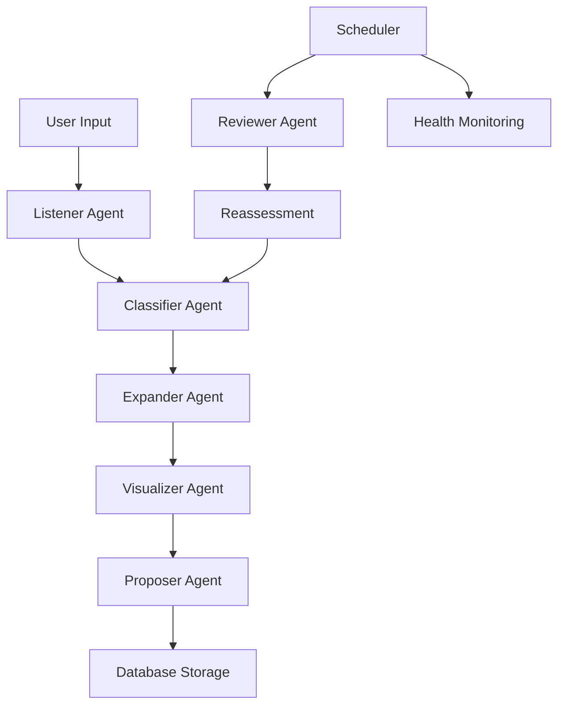

# Dreamcatcher Agent System

*The AI personalities that power your idea factory*

## Agent Architecture

Each agent in Dreamcatcher is a specialized AI entity with its own personality, capabilities, and role in the idea processing pipeline. They communicate through Redis message queues and maintain state through the PostgreSQL database.

## Core Agent Framework

### Base Agent Class

All agents inherit from `BaseAgent` (`backend/agents/base_agent.py`):

```python
class BaseAgent(ABC):
    def __init__(self, agent_id: str, name: str, description: str, version: str):
        self.agent_id = agent_id
        self.name = name
        self.description = description  # Agent's personality
        self.version = version
        self.logger = setup_logger(f"agent.{agent_id}")
        
    @abstractmethod
    async def process(self, data: Dict[str, Any]) -> Dict[str, Any]:
        """Main processing method - implement in each agent"""
        pass
        
    async def send_message(self, recipient: str, action: str, data: Dict[str, Any]):
        """Send message to another agent"""
        pass
```

### Agent Communication

Agents communicate through structured messages:

```python
{
    "sender": "classifier",
    "recipient": "expander", 
    "action": "expand_idea",
    "data": {
        "idea_id": "uuid-here",
        "content": "idea content",
        "classification": {...}
    },
    "timestamp": "2024-01-01T00:00:00Z"
}
```

## Agent Personalities

### 1. Listener Agent (`agent_listener.py`)

**Personality:** *"I heard something. Logging it now."*

**Role:** First contact - captures and transcribes raw input

**Capabilities:**
- Voice recording processing with Whisper
- Text input validation and formatting
- Dream journal entry parsing
- Image OCR and description generation
- Metadata extraction (timestamp, location, device)

**Input Sources:**
- Voice recordings (WAV, MP3, M4A)
- Text messages
- Dream descriptions
- Image uploads with text

**Processing Flow:**
```python
async def process(self, data: Dict[str, Any]) -> Dict[str, Any]:
    # 1. Validate input format
    # 2. Process audio with Whisper if needed
    # 3. Extract metadata
    # 4. Store in database
    # 5. Trigger classifier agent
    # 6. Return processing confirmation
```

**Configuration:**
```json
{
    "whisper_model": "base",
    "auto_capture": false,
    "supported_formats": ["wav", "mp3", "m4a", "ogg"],
    "max_file_size": "10MB",
    "transcription_timeout": 30
}
```

### 2. Classifier Agent (`agent_classifier.py`)

**Personality:** *"I'm not saying this is another ADHD thought spiral, but... yeah it is. Categorized under 'You Might Actually Build This.'"*

**Role:** Analyzes and categorizes ideas with AI-powered insights

**Capabilities:**
- Category classification (creative, business, technical, personal, metaphysical)
- Urgency scoring (0-100)
- Novelty assessment (0-100)
- Tag generation and assignment
- Duplicate detection
- Sentiment analysis

**Categories:**
- **Creative**: Art, music, writing, design projects
- **Business**: Entrepreneurial ventures, monetization ideas
- **Technical**: Software, hardware, engineering solutions
- **Personal**: Self-improvement, lifestyle, habits
- **Metaphysical**: Spiritual, philosophical, consciousness-related

**Processing Flow:**
```python
async def process(self, data: Dict[str, Any]) -> Dict[str, Any]:
    # 1. Analyze content with Claude/GPT
    # 2. Determine category and confidence
    # 3. Score urgency and novelty
    # 4. Generate relevant tags
    # 5. Check for duplicates
    # 6. Update database
    # 7. Trigger expansion agent
```

**AI Prompts:**
```python
classification_prompt = f"""
Analyze this idea: "{content}"

Classify by:
- Category: creative/business/technical/personal/metaphysical
- Urgency (0-100): How time-sensitive is this?
- Novelty (0-100): How original/innovative is this?
- Tags: 3-5 relevant keywords
- Sentiment: positive/neutral/negative
- Complexity: low/medium/high

Provide JSON response with confidence scores.
"""
```

### 3. Expander Agent (`agent_expander.py`)

**Personality:** *"Let me take that spark and turn it into a full flame."*

**Role:** Develops ideas into comprehensive explorations

**Capabilities:**
- Claude integration for creative expansion
- GPT integration for structured analysis
- Category-specific expansion strategies
- Multiple perspective generation
- Cross-pollination with existing ideas

**Expansion Modes:**
- **Creative**: Artistic vision, mediums, emotional impact
- **Business**: Market analysis, revenue models, competitive landscape
- **Technical**: Architecture, implementation, scalability
- **Personal**: Growth benefits, habit formation, life impact
- **Metaphysical**: Consciousness aspects, spiritual practices

**Processing Flow:**
```python
async def process(self, data: Dict[str, Any]) -> Dict[str, Any]:
    # 1. Determine expansion approach from category
    # 2. Generate Claude expansion (creative/visionary)
    # 3. Generate GPT expansion (structured/practical)
    # 4. Create specialized expansion by category
    # 5. Store all expansions in database
    # 6. Trigger visualizer agent
```

**Example Expansion:**
```python
# Creative expansion for "AI music generation app"
creative_expansion = await self._expand_creative(
    content="AI music generation app",
    classification={"category": "creative", "urgency": 75}
)

# Output:
"""
**Artistic Vision:**
Imagine a digital composer that doesn't just generate music, but creates
emotional landscapes. Each piece becomes a collaboration between human
intent and AI creativity...

**Mediums & Techniques:**
- Real-time MIDI generation with emotional feedback
- Visual music representation through dynamic waveforms
- Collaborative composition with multiple AI personalities
...
"""
```

### 4. Visualizer Agent (`agent_visualizer.py`)

**Personality:** *"Darling, that idea needs a visual. Let me handle it."*

**Role:** Creates visual representations using ComfyUI

**Capabilities:**
- ComfyUI workflow generation
- Style-aware prompt engineering
- Multiple visual variations
- Adaptive image generation based on content
- Visual style templates by category

**Visual Styles:**
```python
visual_styles = {
    'creative': {
        'style': 'artistic, abstract, vibrant colors, creative composition',
        'negative': 'boring, conventional, monochrome',
        'steps': 25,
        'cfg_scale': 7.5
    },
    'business': {
        'style': 'professional, modern, clean, corporate, sleek design',
        'negative': 'chaotic, unprofessional, messy',
        'steps': 20,
        'cfg_scale': 7.0
    }
}
```

**Processing Flow:**
```python
async def process(self, data: Dict[str, Any]) -> Dict[str, Any]:
    # 1. Generate visual prompt with AI
    # 2. Create primary visualization
    # 3. Generate alternative style
    # 4. Create abstract interpretation
    # 5. Store images and metadata
    # 6. Trigger proposer agent
```

**ComfyUI Integration:**
```python
# Workflow template for image generation
workflow = {
    "positive_prompt": f"{visual_prompt}, {style_config['style']}",
    "negative_prompt": style_config['negative'],
    "steps": style_config['steps'],
    "cfg_scale": style_config['cfg_scale'],
    "seed": random.randint(1, 1000000)
}
```

### 5. Proposer Agent (`agent_proposer.py`)

**Personality:** *"Proposal generated. Here's a structured plan with bullet points, deadlines, and passive income streams."*

**Role:** Creates actionable project proposals

**Capabilities:**
- Viability analysis with 8-criteria scoring
- Structured proposal generation
- Timeline and milestone planning
- Resource requirement assessment
- Success metrics definition

**Viability Criteria:**
1. **Feasibility**: Technical and practical possibility
2. **Market Demand**: Evidence of need or interest
3. **Resource Requirements**: Realistic resource availability
4. **Timeline**: Achievable timeframe
5. **Uniqueness**: Competitive differentiation
6. **Scalability**: Growth potential
7. **Sustainability**: Long-term viability
8. **Alignment**: Fit with personal/business goals

**Processing Flow:**
```python
async def process(self, data: Dict[str, Any]) -> Dict[str, Any]:
    # 1. Analyze viability with AI
    # 2. Generate structured proposal
    # 3. Create timeline and milestones
    # 4. Assess resource requirements
    # 5. Define success metrics
    # 6. Store proposal in database
    # 7. Trigger high-priority review if needed
```

**Proposal Template:**
```python
proposal_sections = {
    'business': [
        'executive_summary',
        'market_analysis', 
        'business_model',
        'implementation',
        'financials',
        'risk_analysis'
    ]
}
```

### 6. Reviewer Agent (`agent_reviewer.py`)

**Personality:** *"Time to revisit a hidden gem from your archives."*

**Role:** Scheduled reviews and idea resurrection

**Capabilities:**
- Multi-strategy review approaches
- Context-aware idea surfacing
- Pattern-based recommendations
- Serendipitous discovery
- Automated reassessment

**Review Strategies:**
- **Time-based**: Age and dormancy scoring
- **Context-based**: Current relevance assessment
- **Pattern-based**: User preference matching
- **Serendipity**: Random discovery for inspiration
- **Priority Queue**: High-value immediate review

**Processing Flow:**
```python
async def process(self, data: Dict[str, Any]) -> Dict[str, Any]:
    # 1. Select review strategy
    # 2. Identify review candidates
    # 3. Assess current potential
    # 4. Determine next actions
    # 5. Execute recommendations
    # 6. Update system metrics
```

**Review Types:**
```python
review_types = {
    'daily': {'frequency': 'daily', 'max_ideas': 3, 'age_threshold': 1},
    'weekly': {'frequency': 'weekly', 'max_ideas': 5, 'age_threshold': 7},
    'monthly': {'frequency': 'monthly', 'max_ideas': 10, 'age_threshold': 30},
    'quarterly': {'frequency': 'quarterly', 'max_ideas': 20, 'age_threshold': 90}
}
```

## Agent Orchestration

### Pipeline Flow



### Message Queue System

```python
# Redis message structure
{
    "queue": "agent_messages",
    "routing_key": "classifier.process",
    "payload": {
        "sender": "listener",
        "recipient": "classifier",
        "action": "classify_idea",
        "data": {...},
        "correlation_id": "uuid-here",
        "timestamp": "2024-01-01T00:00:00Z"
    }
}
```

### Error Handling

```python
class AgentError(Exception):
    """Base agent error"""
    pass

class ProcessingError(AgentError):
    """Processing failed"""
    pass

class CommunicationError(AgentError):
    """Agent communication failed"""
    pass

# Retry logic
@retry(max_attempts=3, backoff_factor=2)
async def process_with_retry(self, data: Dict[str, Any]):
    try:
        return await self.process(data)
    except Exception as e:
        self.logger.error(f"Processing failed: {e}")
        raise ProcessingError(f"Agent {self.agent_id} failed: {str(e)}")
```

## Performance Monitoring

### Agent Metrics

```python
class AgentMetrics:
    def __init__(self, agent_id: str):
        self.agent_id = agent_id
        self.processed_count = 0
        self.error_count = 0
        self.average_processing_time = 0
        self.last_activity = datetime.now()
        
    def record_processing(self, duration: float, success: bool):
        self.processed_count += 1
        if not success:
            self.error_count += 1
        self.average_processing_time = (
            (self.average_processing_time * (self.processed_count - 1) + duration) 
            / self.processed_count
        )
        self.last_activity = datetime.now()
```

### Health Checks

```python
async def health_check(self) -> Dict[str, Any]:
    return {
        "agent_id": self.agent_id,
        "status": "healthy" if self.is_healthy() else "unhealthy",
        "processed_today": self.metrics.processed_count,
        "error_rate": self.metrics.error_count / max(1, self.metrics.processed_count),
        "average_response_time": self.metrics.average_processing_time,
        "last_activity": self.metrics.last_activity.isoformat(),
        "version": self.version
    }
```

## Development

### Creating New Agents

```python
from agents.base_agent import BaseAgent

class MyNewAgent(BaseAgent):
    def __init__(self):
        super().__init__(
            agent_id="my_agent",
            name="My New Agent",
            description="My agent's personality and purpose",
            version="1.0.0"
        )
    
    async def process(self, data: Dict[str, Any]) -> Dict[str, Any]:
        # Implement your agent logic here
        try:
            # Process the data
            result = await self.do_something(data)
            
            # Trigger next agent if needed
            await self.send_message(
                recipient="next_agent",
                action="process",
                data=result
            )
            
            return {"success": True, "result": result}
            
        except Exception as e:
            self.logger.error(f"Processing failed: {e}")
            return {"success": False, "error": str(e)}
```

### Agent Testing

```python
import pytest
from agents.agent_classifier import AgentClassifier

@pytest.fixture
async def classifier_agent():
    return AgentClassifier()

@pytest.mark.asyncio
async def test_classification(classifier_agent):
    data = {
        "idea_id": "test-id",
        "content": "AI-powered music generation app",
        "source_type": "text"
    }
    
    result = await classifier_agent.process(data)
    
    assert result["success"] is True
    assert "classification" in result
    assert result["classification"]["category"] in ["creative", "business", "technical"]
```

## Configuration

### Agent Settings

```python
# config/agents.yaml
agents:
  listener:
    enabled: true
    whisper_model: "base"
    max_file_size: "10MB"
    
  classifier:
    enabled: true
    ai_model: "claude-3-sonnet"
    confidence_threshold: 0.7
    
  expander:
    enabled: true
    max_expansions: 3
    preferred_model: "claude"
    
  visualizer:
    enabled: true
    comfyui_url: "http://localhost:8188"
    default_style: "modern"
    
  proposer:
    enabled: true
    viability_threshold: 60
    include_timeline: true
    
  reviewer:
    enabled: true
    review_interval: "daily"
    serendipity_factor: 0.2
```

This agent system creates a living, breathing AI collective that thinks about your ideas around the clock, each with its own personality and expertise, working together to turn your creative sparks into actionable reality.

---

*Six AI personalities, one shared mission: never let a great idea slip away.*